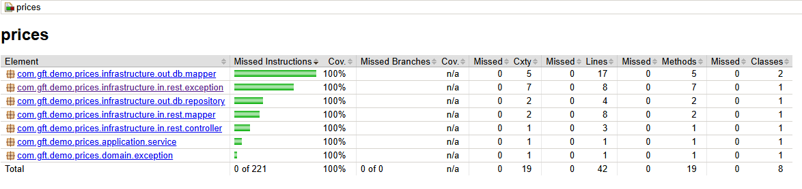

# Introducción
Este es un ejemplo de API para prices implementando arquitectura hexagonal 

# Tools
Las herramientas utilizadas para este ejercicio son:

 * Java - 21
 * Spring Boot - 3.3.4
 * Maven
 * OpenAPI - 3.0.0
 * Cucumber
 * H2 Database

# Requerimientos

Para ejecutar este programa se debe disponer de una instalación de Java 21 y de Maven 3.x.x+, de no disponer de una instalación de maven se puede utilizar el wrapper incluido en el proyecto(mvnw)

# Instrucciones
Una vez se dispone de las herramientas mencionadas, para ejecutar este programa se puede ejecutar el siguiente comando:

    mvn spring-boot:run
O bien si se dispone de IntelliJ u otro IDE capaz de ejecutar la aplicación desde la clase Main (PricesApplication) se debe ejecutar el siguiente comando para disponer de las clases generadas por el plugin de OpenAPI:

    mvn compile
Una vez tenemos las clases generadas en la carpeta target, se puede pulsar el boton de Play y esperar a que la aplicación arranque.

Con la aplicación arrancada se puede acceder al OpenAPI expuesto bajo la url http://localhost:8080/api/v1/swagger-ui.html y probar el controlador desde ahi.

**Nota: Todos los comandos Maven deben ser ejecutados desde la ruta donde se ubica el pom.xml o especificar la ruta relativa/absoluta mediante la opción -f**

# Tests
Para ejecutar los tests se puede ejecutar el siguiente comando maven:

    mvn test
O bien si se dispone de IntelliJ u otro IDE capaz de ejecutar tests, entrar la clase de tests que se quiera ejecutar y pulsar sobre el botón de play.

Para los de cucumber, si se dispone del plugin de IntelliJ, se puede ejecutar desde el fichero feature o ejecutar todos desde la clase CucumberRunnerTest

Aquí se adjunta la cobertura del código utilizando el plugin de jacoco:

Nota: Se han excluido las clases auto-generadas por el plugin de OpenAPI y la clase de arranque de Spring

